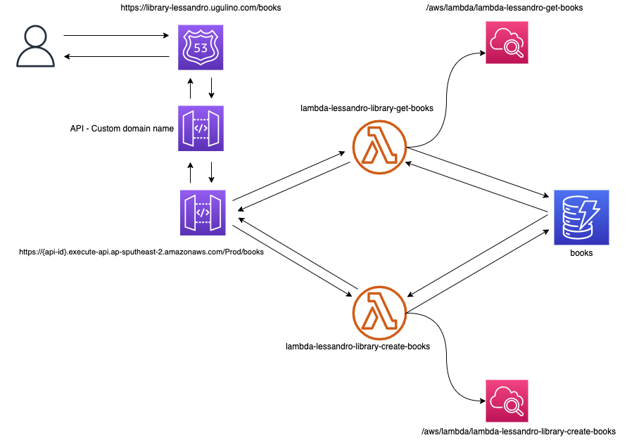

## Index

- [Introduction](#introduction)
- [Diagram](#diagram)
- [Requirements](#requirements)
- [Ansible](#ansible)
  - [Playbook Command](#playbook-command)
- [AWS](#aws)
  - [S3](#s3)
  - [Lambda](#lambda)
  - [API](#api)
  - [DynamoDB](#dynamodb)
  - [Domain](#domain)
- [Application](#application)
  - [Testing](#testing)
- [Destroy](#destroy)
  - [Via Ansible](#via-ansible)
  - [Via CloudFormation](#via-cloudformation)
- [Possible Improvements](#possible-improvements)

## Introduction

_This pipeline via automation will build a backend API that surfaces and ingests data from a connected data source, DynamoDB. An AWS Lambda will connect to the data source, query it, and return the result to the consumer._

## Diagram

The below diagram shows the AWS resources.



## Requirements

1. These tools were installed:

- <a href="https://docs.aws.amazon.com/cli/latest/userguide/cli-chap-install.html">AWS Cli</a>
- <a href="https://docs.ansible.com/ansible/latest/installation_guide/intro_installation.html#installing-ansible-on-macos">Ansible</a>

2. Make sure to upload the zip (zip-pkg folder) file as shown [here](#s3).

3. Update the file `/library-lessandro/vars/main.yml`

## Ansible

### Playbook Command

It'll run the Ansible playbook, executing the defined tasks on the targeted AWS account.

```
ansible-playbook deploy-stack.yml -e RegionName=ap-southeast-2 -e State=present -e create_changeset=yes -e check_mode_override=no
```

**RegionName**

> the region where this deployment will be installed.

**State**

> If state=present and if stack exists and the template has changed, it will be updated.

> If state=absent, the stack will be removed.

**create_changeset**

> create a changeset by submitting changes against the stack you want to update

**check_mode_override**

> simulation to validate the ansible playbook

Run the above ansible command to deploy the _library-lessandro_ ansible role.

**Output**

You can verify the deployment via ansible output or via AWS CloudFormation console.

- Ansible Output:


- AWS CloudFormation Console:


## AWS

### S3

Upload the files to S3 bucket.

<a href="https://docs.aws.amazon.com/AmazonS3/latest/user-guide/create-bucket.html">How do I create an S3 Bucket?</a>


### Lambda

It'll create two lambdas with the API Gateway attached.

_Lambda Get books_


_Lambda Create books_


### API

API Gateway _books_ with two methods, _GET_ and _POST_.


### Domain

Via Ansible automation, an API custom domain was created.


Also, an 'A' record was created pointing to API Custom Domain via automation.


### DynamoDB

A DynamoDb table named _books_ was created.


Once you create a new book, this will be stored in the DynamoDb.


## Application

### Testing

#### Create a new book

To create a new Item on DynamoDb, you can use the below command or via Postman app.

Example:

```
curl -X "POST" -H "Content-Type: application/json" -d "{\"title\": \"Can't Hurt Me\"}" https://library-lessandro.ugulino.com/books
```

Change the _title_ to post a new Book.

_CloudWatch Create Books_

Below is the cloudwatch output once we create a new book.


#### Get all books

https://library-lessandro.ugulino.com/books


_CloudWatch Get Books_

Below is the cloudwatch output once we get the book.


## Destroy

Basically, to destroy this deployment you can either do it via ansible command or AWS CloudFormation.

### Via Ansible

```
ansible-playbook deploy-stack.yml -e RegionName=ap-southeast-2 -e State=absent -e create_changeset=yes -e check_mode_override=no
```

**State**

> Make sure change state to absent

### Via CloudFormation

Select the CloudFormation stack, click delete, and then _Delete stack_.


## Possible Improvements

1. **_Setup AWS WAF to protect the API._**

AWS WAF is a web application firewall that helps protect web applications and APIs from attacks. It enables you to configure a set of rules (called a web access control list (web ACL)) that allow, block, or count web requests based on customizable web security rules and conditions that you define.

2. **_Setup AWS CloudTrail for API Gateway and Lambda._**

Amazon API Gateway is integrated with AWS CloudTrail, a service that provides a record of actions taken by a user, a role, or an AWS service in API Gateway.

3. **_Setup an API key to prevent malicious use or abuse of the API._**

4. **_Setup CloudFront to improve client connection time and high availability._**

5. **_Setup Jenkins or AWS Code Deploy to orchestrate the Ansible deployment._**

6. **_Develop another Lambda to update and delete a book._**
